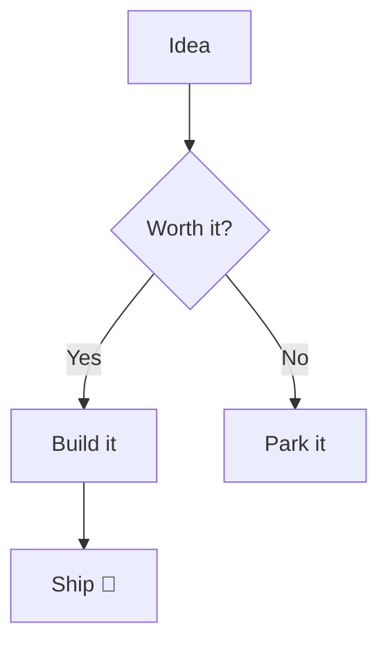

# 📚 Alexandria Markdown Showcase

> [!TIP]
> Copy everything below into a **new note** (or article) to see every
> powered-markdown feature render live. Delete the parts you don't need.

---

## Text basics

**Bold**, *italic*, ~~strikethrough~~, and `inline code`.

You can ==highlight== things, ++underline++ them, and tint words with a
named color: {red|red}, {orange|orange}, {amber|amber}, {green|green},
{teal|teal}, {blue|blue}, {violet|violet}, {pink|pink}, {gray|gray}.

# Heading 1
## Heading 2
### Heading 3

---

## Lists & tasks

- Bullet item
  - Nested bullet
    - Deeper still
- Another item

1. First
2. Second
3. Third

- [x] A finished task
- [x] Another done one
- [ ] Something still to do
- [ ] One more

---

## Callouts

> [!NOTE]
> A neutral note for context.

> [!TIP]
> A helpful tip.

> [!WARNING]
> Careful with this one.

> [!IMPORTANT]
> Don't miss this.

> [!CAUTION]
> This could break things.

> [!COMMENT]
> A side comment.

---

## Quotes, links & images

> "The palest ink is better than the best memory."

A link renders as a chip: [Anthropic](https://www.anthropic.com).

Entity links work too (use real ids in your vault):
`note:1`, `article:2`, `workflow:3`, `list:4`, `flashcard:5`, `blueprint:6`.


---

## Tables

| Feature   | Status      | Notes                    |
| --------- | ----------- | ------------------------ |
| Charts    | ✅ Done      | bar · donut · line       |
| Marquee   | ✅ Done      | colors + gradients       |
| Progress  | ✅ Done      | turns green when complete |

---

## Code (syntax highlighting + copy button)

```elixir
defmodule Greeter do
  def hello(name), do: IO.puts("Hello, #{name}!")
end
```

```python
def fib(n):
    a, b = 0, 1
    for _ in range(n):
        a, b = b, a + b
    return a
```

(Languages: elixir, erlang, javascript, typescript, python, rust, sql,
bash, json, html, css, yaml.)

---

## Mermaid diagrams



---

## Link cards (dashboards)

```cards
title: Anthropic
desc: Makers of Claude
link: https://www.anthropic.com
color: violet
icon: 🤖
---
title: A blueprint
desc: Bold filled card
link: blueprint:1
color: blue
filled: true
---
title: Ocean gradient
desc: No link, just a tile
color: ocean
icon: 🌊
```

---

## Charts

```chart
type: bar
title: Weekly commits
color: blue
Mon: 5
Tue: 8
Wed: 3
Thu: 6
Fri: 9
```

```chart
type: donut
title: Time split
Coding: 8
Meetings: 3
Review: 4
Other: 2
```

```chart
type: line
title: Signups
color: green
Jan: 20
Feb: 35
Mar: 30
Apr: 55
May: 70
```

---

## Marquee banners

```marquee blue normal
🚀 Important — announce it here
```

```marquee candy fast
🎉 Gradient banner scrolling fast — hover to pause
```

```marquee black slow
⚠️ Deploy freeze at 3pm — do not merge to main
```

(Colors: red · orange · amber · green · teal · blue · violet · pink ·
gray · black. Gradients: sunset · ocean · forest · dusk · candy.
Speeds: slow · normal · fast.)

---

## Progress bars

```progress
Tasks: 4/10
Reading Sapiens: 60%
Savings goal: 45 green
Migration: 90% teal
Launch checklist: 10/10
```

(Value forms: `4/10`, `60%`, or a bare `0–100`. Add a trailing color
word to recolor a bar. A bar at 100% turns solid green and shows
**COMPLETE**.)

**Live counter** — a fraction bar shows −/+ buttons in notes & articles;
click to step it and it saves automatically:

```progress
Tasks: 0/8
```

---

## Divider

Use three dashes for a horizontal rule:

---

That's the whole toolbox. Happy writing! ✍️
