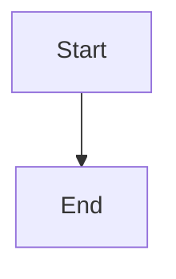

# Sprint 15 — Inline ```mermaid fences in markdown

> Write a ```` ```mermaid ```` fenced block anywhere you write markdown —
> notes, articles — and it renders to a diagram inline, GitHub-style. No
> entity, no `{{diagram:id}}` round-trip: just code in a fence that turns
> into a picture.

## Why

Sprint 14 made Mermaid a **first-class entity** — a diagram you create,
title, pin, and embed via `{{diagram:id}}`. That's the right model for a
diagram you want to *curate and reuse*. But it's heavy for the common
case: jotting a quick flowchart in the middle of a note, the way you'd
drop a fenced code block in a GitHub README. Sprint 14 explicitly
deferred this ("Inline ```mermaid fences in arbitrary notes").

This sprint closes that gap. The two features are complementary, not
redundant:

| Want…                                   | Use                     |
|-----------------------------------------|-------------------------|
| A diagram you reuse, pin, export as PNG | A **Diagram** entity (`{{diagram:id}}`) |
| A throwaway sketch inside this one note | An inline ```` ```mermaid ```` fence |

Everything we need already exists: `renderMermaid(source, theme)` in
`src/lib/mermaid.ts` returns an SVG string, the markdown editors already
inject raw SVG via `{@html}`, and both editors already track
`theme.resolved`. The only missing piece is **intercepting fenced
`mermaid` code blocks in the markdown-it pipeline** — and bridging
markdown-it's *synchronous* render to Mermaid's *asynchronous* one.

## The one hard problem: sync render, async mermaid

`MarkdownEditor.svelte` renders synchronously:

```ts
let rendered = $derived(draft.trim() ? md.render(draft) : "");
// …
{@html rendered}
```

`md.render()` returns a string *now*. `renderMermaid()` returns a
`Promise<string>` *later* (it dynamic-imports the chunky mermaid lib,
then `await`s `mermaid.render`). We cannot produce the SVG during the
markdown pass.

**Solution — placeholder-then-hydrate** (the standard pattern, and the
same `{@html svg}` injection `EmbedBlock`/`DiagramEditor` already use):

1. A custom markdown-it **`fence` rule** detects `info === "mermaid"` and
   emits a *placeholder* instead of `<pre><code>`:
   ```html
   <div class="mermaid-block" data-rendered="0">{ESCAPED SOURCE}</div>
   ```
   The Mermaid source rides along as the element's (HTML-escaped) text
   content. This keeps `md.render()` fully synchronous — no async in the
   derivation.
2. An **`$effect`** runs after `{@html rendered}` lands in the DOM. It
   queries `previewEl` for `.mermaid-block[data-rendered="0"]`, reads
   each one's `textContent` (the browser un-escapes it back to raw
   source), `await`s `renderMermaid(source, theme)`, and replaces the
   element's `innerHTML` with the SVG, flipping `data-rendered="1"`.
3. **Cache + last-good render.** Keep a `Map<sourceKey, svg>` (key =
   `theme + "\n" + source`) so re-renders (every keystroke when editing,
   or a `ResizeObserver` tick) don't re-invoke Mermaid for unchanged
   blocks, and a transient syntax error while typing keeps the previous
   good SVG on screen instead of flashing empty — mirroring
   `DiagramEditor`'s behavior.
4. **Theme.** Re-hydrate when `theme.resolved` flips, re-rendering each
   block with the new Mermaid theme — same as the diagram entity does.

Why text-content and not a `data-src` attribute or an `env` array:
escaping rules for HTML attributes vs. element text differ, and
`md.render(src, env)` env threading is awkward across ArticleEditor's
multi-segment render. Text content is escaped by `md.utils.escapeHtml`
on the way in and un-escaped by the DOM on the way out — clean and
render-count-independent.

## Thread A — Shared markdown-it factory (the real refactor)

`MarkdownEditor.svelte` and `ArticleEditor.svelte` **both** hand-roll an
identical `new MarkdownIt({...})` + `link_open` override (compare
`MarkdownEditor.svelte:27-41` and `ArticleEditor.svelte:24-38`). We're
about to add a second customization (the fence rule) to both — so first
extract the shared setup.

New file **`src/lib/markdownit.ts`**:

```ts
import MarkdownIt from "markdown-it";

// One configured instance shape, used by every markdown surface.
export function createMarkdownIt(): MarkdownIt {
  const md = new MarkdownIt({ html: false, linkify: true, breaks: true, typographer: false });

  // (existing) open links in a new tab / safe rel
  const defaultLinkOpen = md.renderer.rules.link_open ?? ((t, i, o, _e, s) => s.renderToken(t, i, o));
  md.renderer.rules.link_open = (tokens, idx, opts, env, self) => { /* …unchanged… */ };

  // (new) mermaid fences → placeholder for async hydration
  const defaultFence = md.renderer.rules.fence!;
  md.renderer.rules.fence = (tokens, idx, opts, env, self) => {
    const info = tokens[idx].info.trim().toLowerCase();
    if (info === "mermaid") {
      const src = md.utils.escapeHtml(tokens[idx].content);
      return `<div class="mermaid-block" data-rendered="0">${src}</div>`;
    }
    return defaultFence(tokens, idx, opts, env, self);
  };
  return md;
}
```

And the hydration helper (kept next to the factory so both editors share
one cache implementation):

```ts
// Walk a rendered container, render any un-hydrated mermaid placeholders.
export async function hydrateMermaidBlocks(
  root: HTMLElement,
  theme: "dark" | "default",
): Promise<void> { /* query .mermaid-block, renderMermaid, swap innerHTML, cache */ }
```

Then **replace the inline `new MarkdownIt(...)` blocks** in both editors
with `createMarkdownIt()`. Net: less duplication *and* the fence support
arrives in both surfaces at once.

## Thread B — Hydration in `MarkdownEditor.svelte`

- Import `theme` from `$lib/stores/theme.svelte` (not currently
  imported) and `hydrateMermaidBlocks` from `$lib/markdownit`.
- Replace the local MarkdownIt with `createMarkdownIt()`.
- Hydrate with a **`MutationObserver`**, not a one-shot effect:
  ```ts
  $effect(() => {
    const el = previewEl;
    const t = theme.resolved === "dark" ? "dark" : "default";
    if (!el) return;
    hydrateMermaidBlocks(el, t);
    const mo = new MutationObserver(() => hydrateMermaidBlocks(el, t));
    mo.observe(el, { childList: true, subtree: true });
    return () => mo.disconnect();
  });
  ```

  **Why an observer and not a plain effect keyed on `rendered`** (learned
  the hard way during implementation): `{@html rendered}` *rewrites the
  preview's innerHTML out from under us*. The killer case is commit — you
  type a fence, click out, the SVG hydrates… then `onCommit` saves the
  body, the store hands the saved string back as `value`, the
  `if (!editing) draft = value` sync effect reassigns `draft`, `rendered`
  re-derives to a fresh string, and `{@html}` **replaces the whole
  subtree — wiping the SVG back to the raw placeholder.** A one-shot
  effect (even one depending on `rendered`) races this: it hydrates once,
  the post-commit re-render blows it away, and nothing it depends on
  changes again, so it never retries. Symptom: *raw mermaid source shown
  after editing, but the diagram appears if you navigate away and back*
  (a fresh mount times correctly). The observer fixes it structurally —
  any innerHTML rewrite fires it and re-hydration runs. The source+theme
  cache + `renderedKey` guard make repeat passes a no-op and stop the
  observer from looping on its own SVG injection.

  This mirrors the existing `ResizeObserver` "isLarge" effect right below
  it — same "external DOM keeps changing, re-process on mutation" shape.
  `previewEl` is the `bind:this` preview container.

## Thread C — Hydration in `ArticleEditor.svelte`

`ArticleEditor` splits the body into `md` and `embed` segments and
renders each `md` segment with the shared instance. A ```` ```mermaid ````
fence lives *inside* an `md` segment (it is not an `{{embed}}` line), so:

- Swap its MarkdownIt for `createMarkdownIt()`.
- Add the same `MutationObserver`-based hydration effect as Thread B
  (one observer on `previewEl` covers placeholders across every `md`
  segment). The per-segment `{@html}` blocks get rewritten on the same
  edit/commit/theme triggers, so the observer is needed here too.
- **Do not** touch `EMBED_LINE` / the segment parser — fences are markdown
  content, deliberately orthogonal to the `{{diagram:id}}` entity-embed
  mechanism. A note with three quick fenced sketches creates zero
  entities; that's the point.

## Thread D — Editor affordance (small)

Add an **"Insert diagram"** button to both editors' toolbars (next to
"Insert table", `MarkdownEditor.svelte:259-269`), inserting a starter
fence via the existing `insertAtCursor`:

````md

````

Reuses the exact insert/cursor-restore plumbing already there. Optional
but cheap, and it teaches the feature's existence.

## Thread E — Styling

Add to the `markdown-body` styles (and ArticleEditor's equivalent):

```css
.markdown-body :global(.mermaid-block) {
  display: flex;
  justify-content: center;
  margin: 0.6rem 0;
}
.markdown-body :global(.mermaid-block svg) {
  max-width: 100%;
  height: auto;
}
```

Mirror `EmbedBlock`'s `.diagram-embed :global(svg)` rule. While a block
is still `data-rendered="0"`, it shows the raw source as text — an
acceptable sub-second flash before the SVG swaps in (and the visible
fallback if mermaid fails to load entirely).

## What we are NOT doing

- **No backend, no migration, no IPC.** This is 100% client-side
  rendering of text that already lives in note/article bodies. Nothing
  touches SQLite, `map_nodes`, or any command. (Contrast Sprint 14,
  which added a whole entity.)
- **No new entity, no Summary tab, no pinning.** Inline fences are
  content, not entities. The Diagram entity stays the home for
  reusable/exportable diagrams.
- **No PNG export of inline fences.** If you want to export it, promote
  it to a Diagram entity. (Possible future nicety: a "↗ Save as Diagram"
  affordance on a hovered inline block — deferred.)
- **No canvas node.** Still the standing Sprint 14 follow-up.

## Risks / watch-items

- **`securityLevel: "strict"`** is already set in `mermaid.ts` — inline
  fences inherit it, so user-authored Mermaid can't inject script. Good,
  no new surface. (`html: false` on markdown-it also stands.)
- **Re-render thrash while typing**: the source-keyed cache is what keeps
  this cheap — confirm a block with unchanged source is *not* re-rendered
  on every keystroke (it should be a Map hit). Watch for the
  `ResizeObserver` ↔ hydration `$effect` feedback loop; gate hydration on
  `data-rendered === "0"` so a swapped-in SVG (which changes height,
  firing the observer) doesn't retrigger a render.
- **Mermaid's `render()` id collisions**: `mermaid.ts` already uses a
  monotonic `renderSeq`, so multiple blocks on one page get unique ids.
  Verify a note with 2+ fences renders all of them.
- **Theme flip mid-view**: re-hydration must reset `data-rendered` (or
  re-render unconditionally on theme change) so existing SVGs re-theme,
  not just newly-added ones.

## Round-trip checks

- `npx svelte-check --tsconfig ./tsconfig.json` (new `markdownit.ts`,
  edited editors).
- No `cargo` work this sprint (no backend changes) — but run
  `pnpm tauri dev` once anyway to exercise the real WKWebView path.
- In `pnpm tauri dev`:
  - A note with a ```` ```mermaid ```` flowchart renders inline; a
    regular ```` ```js ```` fence still renders as a normal code block
    (fence fallthrough intact).
  - Two mermaid blocks in one note both render.
  - Break the syntax mid-edit → last good SVG persists, no empty flash.
  - Toggle dark mode → inline diagrams re-theme.
  - Same in an article body, alongside an existing `{{diagram:id}}`
    embed, to confirm the two mechanisms coexist.
  - "Insert diagram" button drops a working starter fence.

## Touched files (summary)

- **new** `src/lib/markdownit.ts` — shared factory + `hydrateMermaidBlocks`.
- `src/lib/components/MarkdownEditor.svelte` — use factory, add hydrate
  effect, theme import, "Insert diagram" button, styles.
- `src/lib/components/ArticleEditor.svelte` — same, on its multi-segment
  preview.
- (reused, unchanged) `src/lib/mermaid.ts`, `theme.svelte.ts`.
