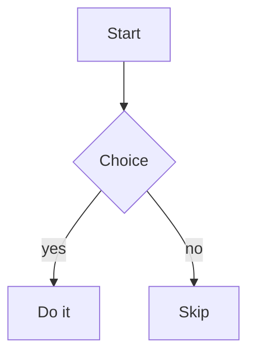
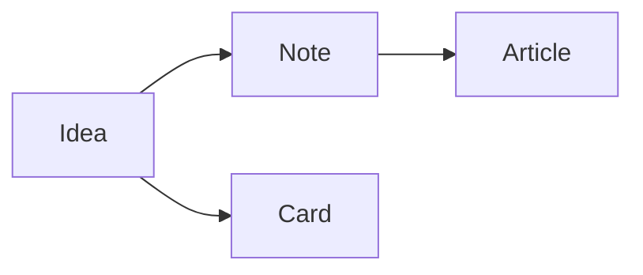

# Alexandria markdown — what you can write

Everything you can use in note bodies, article bodies, and workflow notes. The
custom bits (color, highlight, callouts, mermaid, links, embeds) are Alexandria
additions on top of standard GitHub-style markdown.

> Tip: to **see** any of this render, copy a snippet into a note or article and
> click outside the editor (or the Edit button) to preview. There's a **live
> playground** at the very bottom you can paste whole.

---

## 1. Standard formatting

```md
# Heading 1
## Heading 2
### Heading 3

**bold**   *italic*   ~~strikethrough~~   `inline code`

> A normal blockquote.

- bullet
- bullet
  - nested bullet (2-space indent) → different bullet shape
    - third level → another shape

1. numbered
2. numbered
   1. nested → switches to a, b, c
      1. deeper → switches to i, ii, iii

[a normal link](https://example.com)
https://bare-urls-autolink-too.com


---  (three or more dashes on their own line = a divider)
```

Notes:
- Single Enter = a line break (soft breaks are on).
- Nested lists now use distinct bullets (•, ◦, ▪) and numbering (1 → a → i).
- Raw HTML is **not** rendered (it's escaped) — use the markdown below instead.

## 2. Tables

```md
| Feature   | Status |
| --------- | ------ |
| Headers   | styled |
| Cells     | wrap   |
```

The header row gets a distinct shaded style automatically.

## 3. Colored text  `{color|…}`

```md
This is {red|urgent}, this is {green|done}, and this is {blue|a note}.

## {violet|Section title}   ← works inside headings too
```

Available colors: `red` `orange` `amber` `green` `teal` `blue` `violet` `pink`
`gray`. (Colors auto-adjust for light/dark mode.)

## 4. Highlight  `==…==`

```md
Remember ==this important phrase== for later.
```

Renders with a yellow highlighter background.

## 5. Callout / comment blocks  `> [!TYPE]`

A blockquote whose first line is `[!TYPE]` becomes a colored, labeled panel:

```md
> [!NOTE]
> General information worth pointing out.

> [!TIP]
> A helpful suggestion.

> [!WARNING]
> Something to be careful about.

> [!COMMENT]
> A personal aside — stands out so you spot it while reading.

> [!IMPORTANT]
> Critical, don't-miss content.

> [!CAUTION]
> Risky / destructive — proceed carefully.
```

## 6. Mermaid diagrams  ` ```mermaid `

A fenced code block tagged `mermaid` renders as a diagram inline:

````md

````

Other mermaid types work too (`sequenceDiagram`, `pie`, `gantt`, `classDiagram`,
…). A syntax error shows inline; fix it and it re-renders.

## 7. Links to other entities  `[label](kind:id)`

Link to another note / article / workflow / list — clicking navigates in-app:

```md
See [the onboarding note](note:5) and [the release workflow](workflow:3).
```

Forms: `note:ID`, `article:ID`, `workflow:ID`, `list:ID`. Easiest way to make one
is the **Insert link** button in the editor toolbar (it picks the entity for
you). If the target was deleted, clicking just shows a small "no longer exists"
message instead of erroring.

> The **`#tag` badges** you may have seen are for **feedback board / card
> titles**, not note/article bodies. In a body, `#something` at the start of a
> line is just a heading.

## 8. Embedding entities — **articles only**  `{{kind:id}}`

In an **article** body, put an embed token **on its own line** to render that
entity inline:

```md
Some intro text.

{{note:5}}
{{workflow:3}}
{{list:8}}
{{article:2}}
{{todo:14}}

More text after the embeds.
```

Forms: `{{note:ID}}`, `{{article:ID}}`, `{{workflow:ID}}`, `{{list:ID}}`,
`{{todo:ID}}`. (This works in the **article** editor only — in a plain note,
`{{note:5}}` shows as literal text. Use a `note:5` link there instead.)

## 9. Images

```md

```

You can also **paste** an image straight into the editor, or use the **Insert
image** toolbar button — both save it locally and insert the markdown for you.

## 10. Editor conveniences (not syntax)

- **Tab** inserts two spaces (it no longer jumps focus out of the editor).
- A **word count** shows in the editor toolbar while writing.
- **Insert link / table / image / diagram** buttons are in the toolbar.
- Click outside (or Esc) to render; click the text / Edit button to edit again.

---

## Live playground — paste this whole block into a note to test

Headings with color: 

## {blue|Architecture} and {amber|Risks}

Body text with ==a highlight==, some {red|red warning text}, {green|green ok},
{violet|violet}, and ~~struck out~~ plus `code`.

- top level
- another
  - nested
    - deep
1. first
2. second
   1. sub
      1. subsub

| Column A | Column B |
| -------- | -------- |
| one      | two      |
| three    | four     |

> [!TIP]
> Copy this whole section into a note and click outside to see it render.

> [!COMMENT]
> This panel should look distinct so it's easy to spot while reading.



A divider:

---

End of playground.
